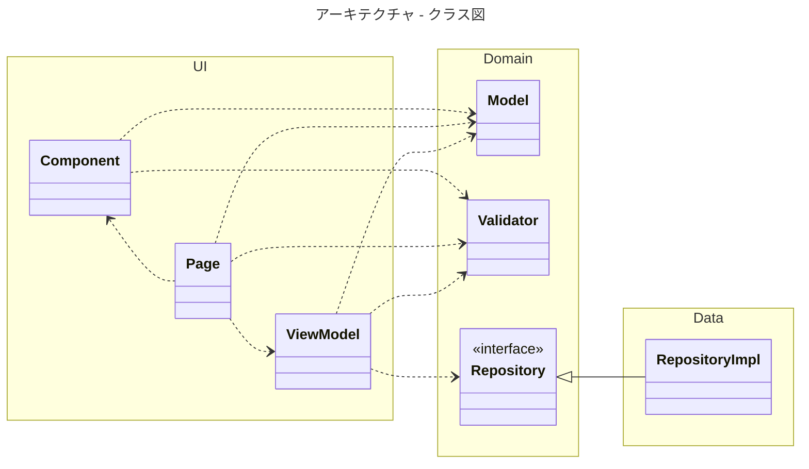

# TODOアプリ
Flutter の勉強用に作成している Todo 管理アプリ

以下の issue に沿って実装を行う
- https://github.com/r-k-ishizaka/todo_app_flutter/issues/1

# アーキテクチャ

```mermaid
---
title: アーキテクチャ - クラス図
---
classDiagram
  direction LR
    Component <.. Page
    Component ..> Model
    Component ..> Validator
    Page ..> ViewModel
    Page ..> Model
    Page ..> Validator
    ViewModel ..> Repository
    ViewModel ..> Validator
    ViewModel ..> Model
    Repository <|-- RepositoryImpl

    namespace UI {
      class Component {
      }
      class Page{
      }
      class ViewModel{
      }
    }
    namespace Domain {
      class Repository{
        <<interface>>
      }
      class Validator{
      }
      class Model {
      }
    }
    namespace Data {
      class RepositoryImpl{
      }
    }

```
